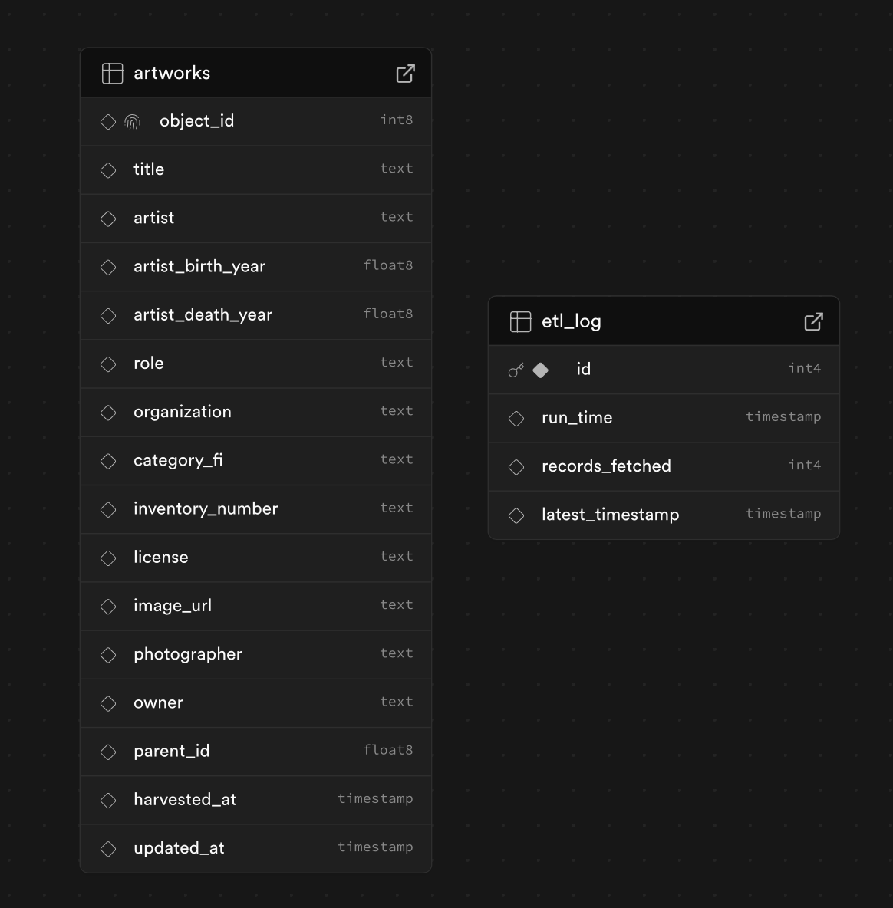

# Finnish National Gallery ETL Pipeline

A complete **ETL** pipeline that collects, cleans, and stores artworks data from the **Finnish National Gallery API** 
into a **PostgreSQL (Supabase)** database.

---

### Why I did this project

I did this project to understand how to build a modular data pipeline using Python. 
It automatically extracts artworks data from an open API, transforms it into a clean tabular format,  
and loads or upserts it into a cloud database for analysis.

My ETL pipline supports **incremental updates**, ensuring that only new or modified records are processed 
after the initial load.

---

 For this project I used: Python, PostgreSQL and I am going to put everyting in a Docker container with airflow.

